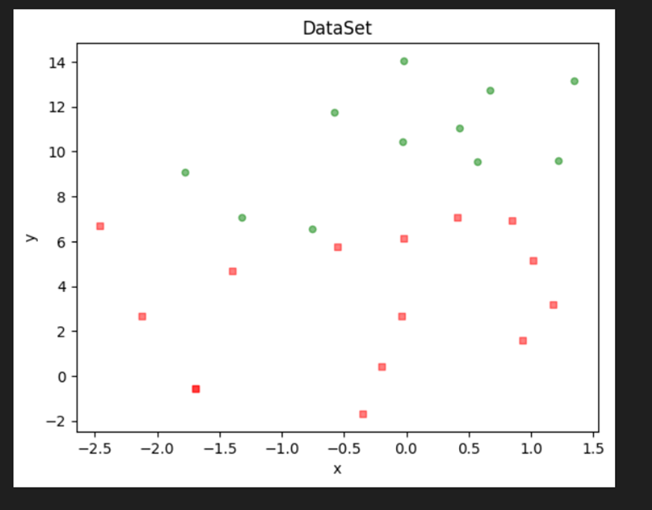
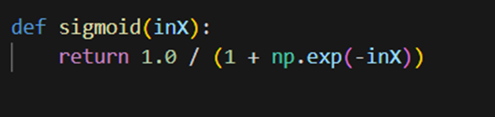
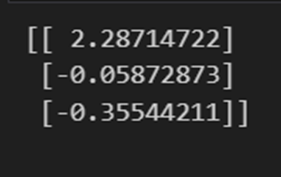
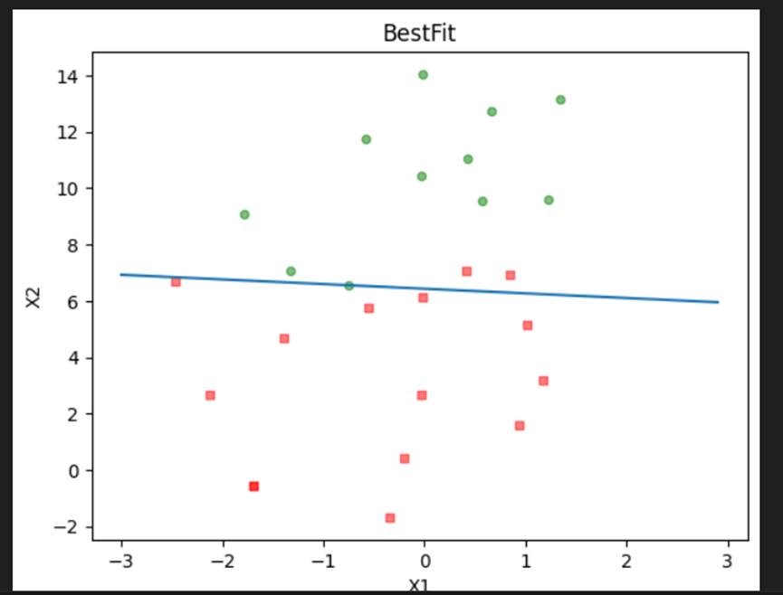
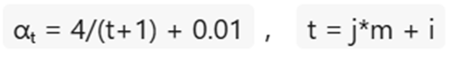
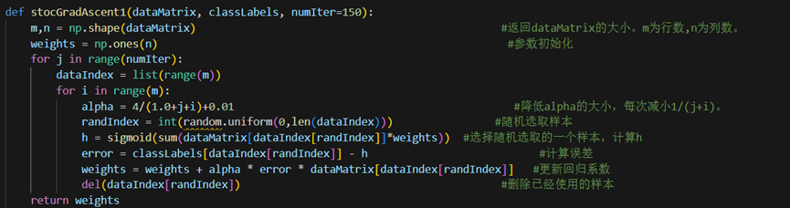
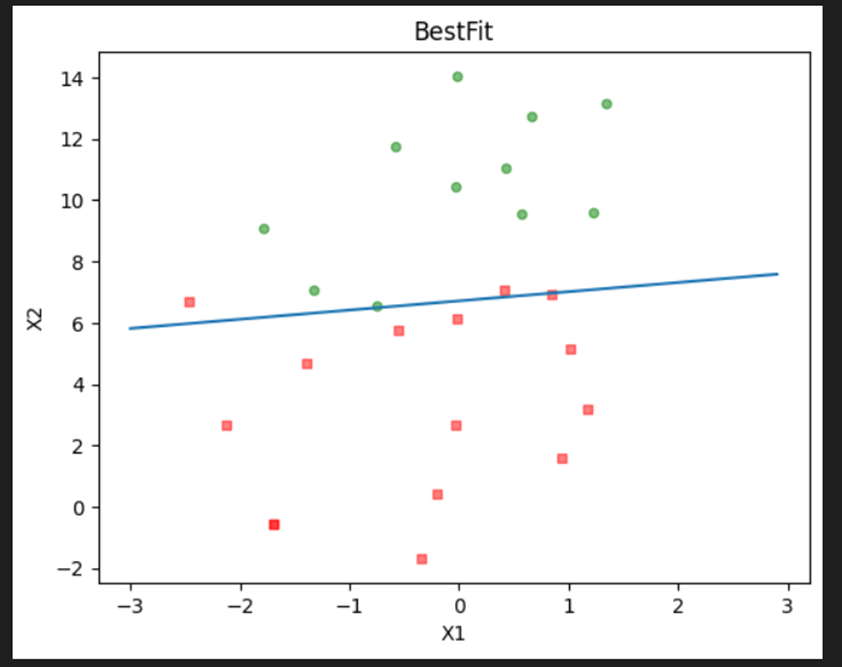
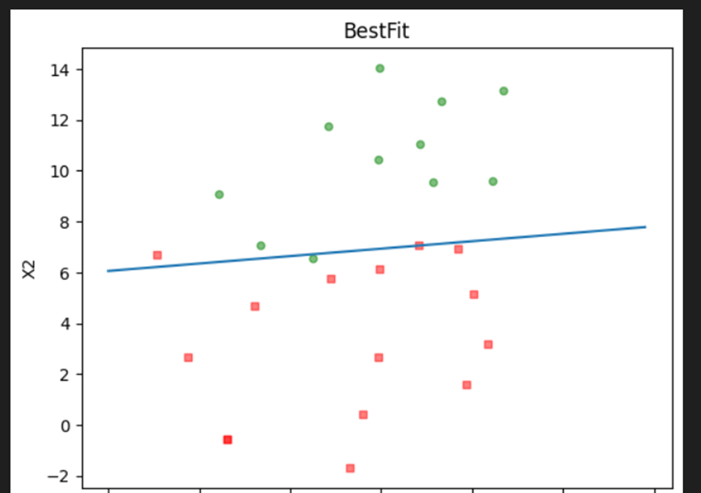
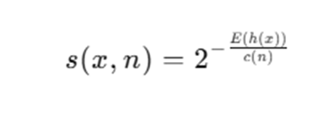

 **随机梯度下降（SGD)**：

​       通过每个样本迭代更新一次，在随机梯度下降中，随机选择几个样本而不是每次迭代整个数据集。在BGD中，batch被视为整个数据集。在SGD中，执行每次迭代计算梯度仅使用单个样本，即batch大小为1。被选择用于迭代的样本被随机打乱

​       常见的梯度下降有三种形式：BGD、SGD、MBGD，它们的不同之处在于我们使用多少数据来计算目标函数的梯度，

​       梯度是函数的斜率。它衡量一个变量响应另一个变量的变化而变化的程度，梯度越大，坡度越陡。从初始值开始，迭代运行梯度下降以找到参数的最佳值，以找到给定成本函数的最小可能值。梯度下降是一种优化算法，通常用于寻找深度学习算法中的权值及系数，如逻辑回归。它的工作原理是让模型对训练数据进行预测，并使用预测中的error来更新模型从而减少error，找到使模型在训练数据集上的误差最小化的模型参数

​      SGD算法中的一个关键参数是**学习率**。在实践中，有必要随着时间的推移逐渐降低学习率。SGD中梯度估计引入的噪声源(m个训练样本的随机采样)并不会在极小点处消失。相比之下，当我们使用批量梯度下降到达极小点时，整个代价函数的真实梯度会变得很小，之后为0，因此批量梯度下降可以使用固定的学习率。

**随机梯度上升**：

为了将模型给出的概率更趋向于1，将对数似然函数（目标函数）最大化

若计算损失（将负对数似然当损失）就用随机梯度下降，损失最小化。

使用随机数据集：

梯度上升迭代公式：

1.**梯度上升**：

通过定义error，使用梯度上升，沿着梯度方向迭代500步，步长0.001得到最优权重向量：w = [w₀, w₁, w₂]    ，其中weights += α · dataMatrixᵀ · error

画图：

2.**随机梯度上升**：

​        每次更新回归系数(最优参数)的时候，不用所有样本，一次只用一个样本点去更新回归系数(最优参数)，可以有效减少计算量。

​       该算法第一个改进之处在于，**alpha在每次迭代的时候都会调整**，并且，虽然alpha会随着迭代次数不断减小，但永远不会减小到0，因为这里还存在一个常数项。必须这样做的原因是为了保证在多次迭代之后新数据仍然具有一定的影响。如果需要处理的问题是动态变化的，那么可以适当加大上述常数项，来确保新的值获得更大的回归系数。另一点值得注意的是，在降低alpha的函数中，alpha每次减少1/(j+i)，其中j是迭代次数，i是样本点的下标。第二个改进的地方在于**更新回归系数(最优参数)时，只使用一个样本点，并且选择的样本点是随机的**，每次迭代不使用已经用过的样本点。这样的方法，就有效地减少了计算量，并保证了回归效果。

其中，Alpha：

核心代码：

运行结果：

因为样本是随机取所以结果也不一样。

**论文**（NDSS 2024）：提高安全和可靠性分散式系统：一种集成 Snort 规则和机器学习的混合方法

1.主要内容：

该论文将传统的**Snort规则**与先进的**机器学习技术**结合，以增加网络流量中的异常检测。由于机器学习模型，特别是无监督学习算法，擅长在大型数据集中识别模式和偏差，使其适用于检测不符合预定义规则的异常，检测未知不断演变的威胁。具体而说是将Snort规则作为特征用于ML模型，尤其是**isolation Forest（孤立森林）**和**K-Means Clustering（K均值聚类）**来识别异常，ML模型检测到的异常会交给安全专家审查，并完善提取过程重新训练ML模型，使IDS能够**不断适应演变的威胁**，并在CICIDS2017数据集上验证模型性能。

2.专有名词解释

2.1 **入侵检测系统**

入侵检测系统IDS：用于监控网络或系统活动，以发现未经授权的访问、恶意活动或违反安全策略的行为

入侵防御系统IPS：检测并自动阻断

常用IDS工具：

**Snort**：开源网络 IDS，规则丰富，社区活跃。

 Suricata：高性能替代 Snort，支持多线程和 IPS 模式。

 OSSEC：开源主机 IDS，支持日志分析、文件完整性检查。

 Wazuh：基于 OSSEC 的增强版，集成 SIEM 功能。

2.2 **Snort**

Snort：通过实时流量抓包、规则匹配、告警/阻断，帮助发现网络中的恶意活动或策略违规

部署位置：互联网 ── 防火墙 ── [Snort Sensor] ── 核心交换机 ── 内网

规则·示例：action proto src_ip src_port -> dst_ip dst_port

​         动作+协议+源ip 源端口 -> 目的ip 目的端口

E.g. HTTP请求中有“hack”，警告： 

alert tcp any any -> any 80

(msg:"Possible hack attempt in HTTP"; content:"hack"; nocase; sid:1000001;)

告警描述+字符串+不区分大小写+编号

2.3 **isolation Forest（孤立森林）**

Isolation forest是一种无监督异常检测算法，“异常点是少数且不同的，因此可以被孤立处理”。

过程：

对于每个样本，计算它在所有孤立树中的平均路径长度（从根到叶子的边数）。路径越短 → 越容易被孤立 → 越可能是异常。用如下公式计算异常得分：

其中：E(h(x))：样本 x 在所有树中的平均路径长度，c(n)：样本数为 n 时的归一化因子（用于比较）

得分接近1越异常，接近0越正常

特点：

1. 不需要标签，适合检测未知异常

2. 时间复杂度低，适合大数据

3. 内存占用低1

4. 适合“点”异常，不适合群组类型

   

2.4 **K-Means Clustering（K均值聚类）**

K-Means Clustering是将数据划分为k个簇（cluster），使得同一个簇内的数据点相似度高，不同簇间相似度低，距离大于平均水平的点就是异常。

过程：

1. 初始化：

随机选择 K 个初始中心点（centroids），可以是随机样本点。

2. 分配样本：

对每个数据点，计算它到 K 个中心点的距离（通常用欧氏距离）。

把它分配给最近的中心点，形成 K 个簇。

3. 更新中心：

对每个簇，重新计算中心点（即该簇内所有点的平均值）。

4. 迭代：

重复步骤 2 和 3，直到中心点不再变化，或达到最大迭代次数，或变化小于某个值

特点：

1. 算法易于实现，适合大规模数据
2. 通常迭代几次就能收敛
3. 可能陷入局部最优
4. 不适用于复杂形状的簇

2.5 **CICIDS2017数据集**

CICIDS2017数据集：是由加拿大新不伦瑞克大学网络安全研究所（CIC）发布的网络入侵检测（IDS）专用数据集，广泛用于机器学习、异常检测、入侵检测系统研究。

其中：

数据类型：网络流量（PCAP）与提取特征（CSV）

标签类型：每条流量都标注为“正常”或某种攻击类型